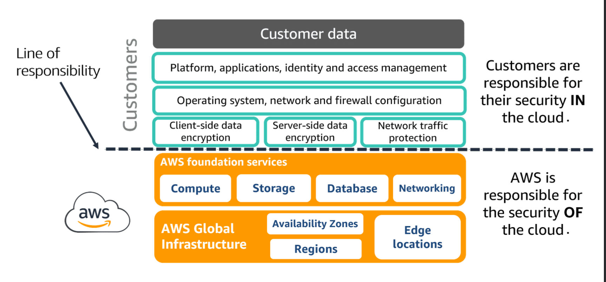

# AWS Security Best Practices

## Shared Responsibility Model

* **Security IN the Cloud Vs Security OF the Cloud.**
	* Customer is responsible for the Security IN the Cloud.
		* Customers need to manage their Applications,Identity Management,OS,Encryption, Network/Firewall/Protection ...
	* AWS is responsible for the Security OF the Cloud.
		* AWS manages the global infra, undergoes audits,keeps the global infra running with service and service endpoints along with security and improvement.

* **Customer Challenges.**
	* *Vulnerabilities* - Weakness.
		* CVE's - Openly available exploits of Customer utilizing application.
	* *Threat* - Possibility of exploiting a Vulnerability.
		* DOS/Malware/Unauthorized access/Misconfiguration.
	* *Risk* - Potential Loss of a resource due to a threat.
		* *Risk Analysis*.
			* Quantitative - mathematical models and simulations to assign values to risk.
			* Qualitative - Subjective to a theoretical model of the risk in a given scenario which designed basing of likelihood and impact of the threat being assessed.
		* *Risk Management*.
			* Mitigate - by patching or applying controls.
			* Avoid - alter operations and forgo benefits too.
			* Accept - realize the organization can absorb the potential impact.
			* Transfer - give it to other party to manage.

